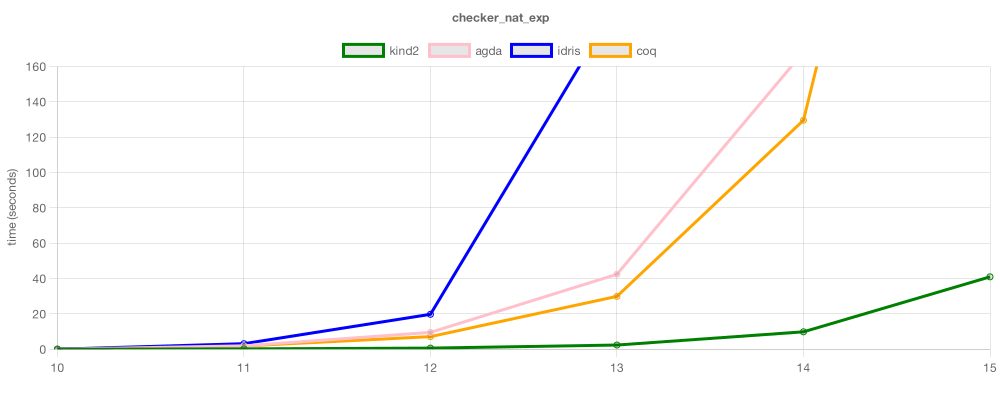
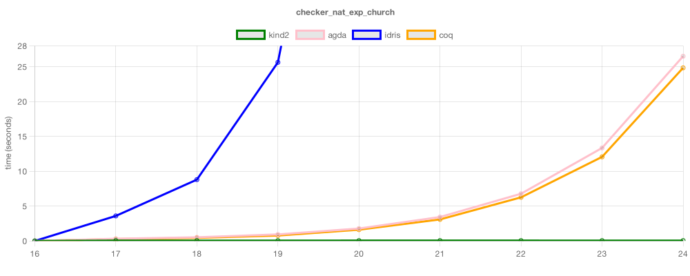
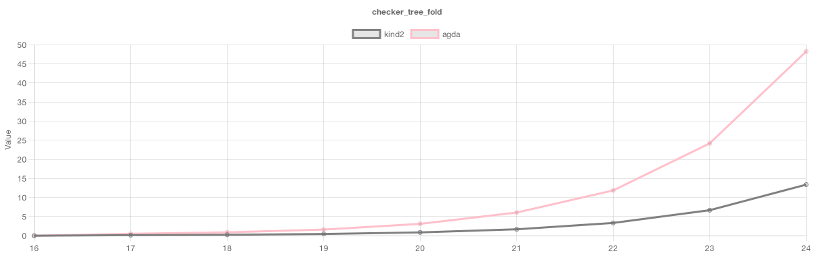
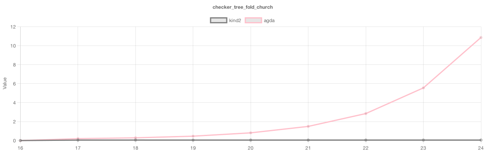
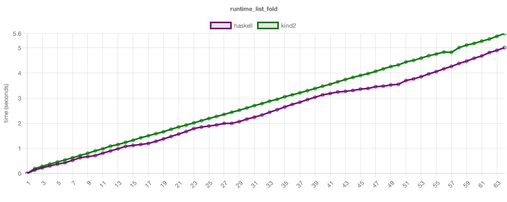
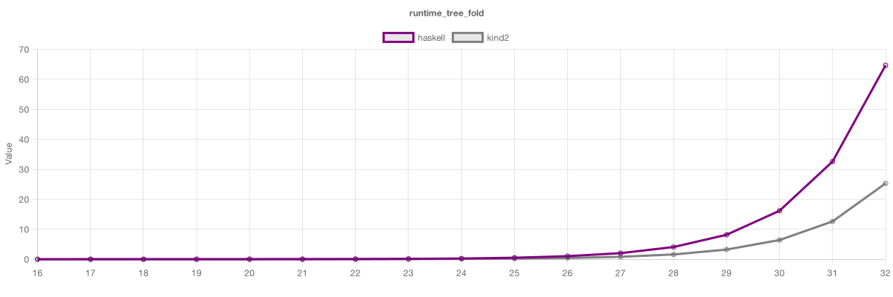

Functional Benchmarks
=====================

This repository contains a collection of benchmarks of functional programming languages and proof assistants. It is split in two categories, Checker and
Runtime, which measure the time it takes to type-check, and run, a program, respectivelly.

## Checker.nat_exp

Performs exponentiation of natural numbers on the type-level.

```agda
exp : Nat -> Nat -> Nat
exp a zero     = succ zero
exp a (succ b) = mul a (exp a b)

main : Equal (is-even (exp C-2 N)) true
main = refl
```



## Checker.nat_exp_church

Performs exponentiation of Church encoded natural numbers on the type-level. 

```agda
C-exp : C-Nat -> C-Nat -> C-Nat
C-exp a b = λ p -> b (p -> p) (a p)

main : Equal (C-is-even (C-exp C-2 N)) C-true
main = refl
```



## Checker.tree_fold

Creates a perfect binary tree and folds over it with Boolean conjunction on the type level.

```agda
tree-fold : Tree -> (p : Set) -> (n : p -> p -> p) -> (l : p) -> p
tree-fold leaf       p n l = l
tree-fold (node a b) p n l = n (tree-fold a p n l) (tree-fold b p n l)

force-tree : Tree -> Bool
force-tree t = tree-fold t Bool (λ a b -> and a b) true

main : Equal (force-tree (full-tree N)) true
main = refl
```



## Checker.tree_fold_church

Creates a Church encoded perfect binary tree and folds over it with Boolean conjunction on the type level.

```agda
C-tree-fold : C-Tree -> (p : Set) (n : p -> p -> p) (l : p) -> p
C-tree-fold t p n l = t p n l

C-force-tree : C-Tree -> C-Bool
C-force-tree t = C-tree-fold t C-Bool (λ a b -> C-and a b) C-true

Main : Equal (C-force-tree (C-full-tree N)) C-true
Main = Base.refl
```



## Runtime.list_fold

Creates a large list and folds over it with uint64 addition.

```haskell
fold :: List a -> (a -> r -> r) -> r -> r
fold Nil         c n = n
fold (Cons x xs) c n = c x (fold xs c n)

range :: Word64 -> List Word64 -> List Word64
range 0 xs = xs
range n xs =
  let m = n - 1
  in range m (Cons m xs)

main = print $ fold (range N Nil) (+) 0
```



## Runtime.tree_fold

Creates a large list and folds over it with uint64 addition.

```haskell
gen :: Word32 -> Tree
gen 0 = Leaf 1
gen n = Node (gen(n - 1)) (gen(n - 1))

sum :: Tree -> Word32
sum (Leaf x)   = 1
sum (Node a b) = sun a + sun b

main = sum (gen N)
```




Replicating
===========

To replicate these benchmarks, just run:

```
node run benchmark.js
```

For specific commands, check the contents of [benchmark.js](benchmark.js).
